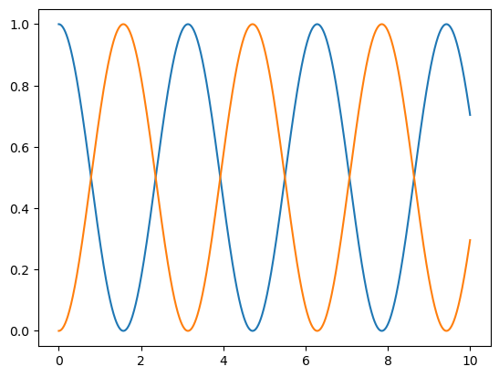

# Tutorial

A continuación se va a dar un ejemplo del uso de las funciones ya documentadas para un cálculo.

```{r test-python, engine='python'}

import numpy as np
import matplolib.pyplot as plt

# Se asigna el operador lineal
oOper = np.array([[0, 1], [1, 0]])

# Se asigna el estado incial
yInit = np.array([[1, 0], [0, 0]])

# El arreglo de tiempos mencionado
times = np.linspace(0,10,1000)

# Se calcula el intervalo de tiempo haciendo la diferencia entre dos pasos temporales consecuentes
h = times[1] - times[0]

# Se va a crear una copia del estado incial para guardarlo.
yCopy = yInit.copy()

# Se van a inicializar dos arreglos que van a contener los valores con valores iniciales cero. Utilizamos el mismo tamaño del arreglo que contiene la variable independiente temporal: 
stateQuant00 = np.zeros(times.size)
stateQuant11 = np.zeros(times.size)

# Esta sería la rutina que realiza la evolución temporal
for tt in range(times.size):
    # Guarde el valor de las entradas (0,0) y (1,1) en los arreglos que definimos
    # Obtenga estos valores de las entradas de yInit
    stateQuant00[tt] = yInit[0,0].real
    stateQuant11[tt] = yInit[1,1].real

    # Se invoca rk4 operando sobre yInit
    # y se devuelve el resultado a un nuevo yN
    yN = rk4(dyn_generator, oOper, yInit, h)

    # Ahora se asigna yN a yInit
    # De esta manera, en la siguiente iteración, el operador de esta iteración se convierte en el inicial
    # de la siguiente iteración
    yInit = yN

# Se va a hacer un gŕafico de los resultados usando la biblioteca `matplotlib` que se incluyó al principio del código:

plt.plot(times,stateQuant00)
plt.plot(times,stateQuant11)
plt.show()
```
El gráfico quedaría así:

